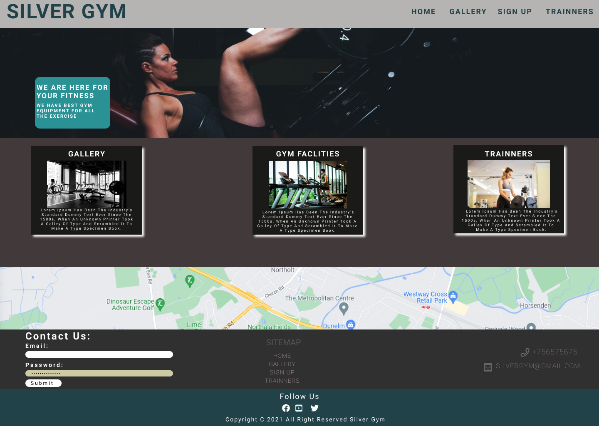
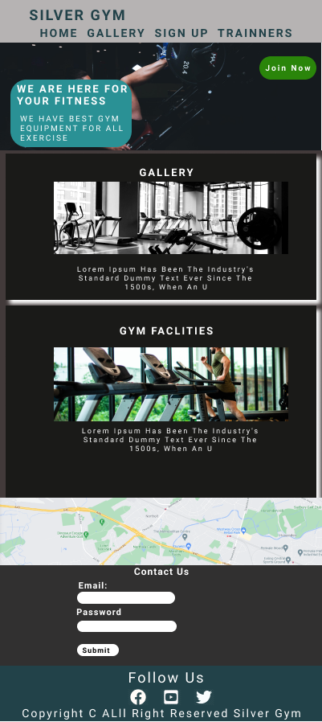

# Silver Gym
## Contents
1. [Introduction](#Introduction)

2. [User Experience](#User-Experience) 
   - [User Stories](#User-Stories)

3. [Target](#Target)
   - [Skeleton](#skeleton) 

4. [Design](#Design)
   - [Colour Schema](#Colour-Schema)
   - [Typography](#Thpography)
   - [Imagery](#Imagery)

5. [Features](#Features)
    - [Header](#Header)
   - [Home Page](#Home-Page) 
   - [Gallery Page](#Gallery-Page)
   - [Signup Page](#Signup-Page)
   - [Trainners Page](#Trainners-Page)
   - [Facilities Page](#Facilities-Page)
   - [Footer](#Footer) 

6. [Other Features](Other-Featues)

7. [Feature Left to Implement](#Feature-Left-to-Implement)

8. [Technologies Used](#Technologies-Used)
   - [Languages Used](#Languages-Used)

9. [Frameworks, Libraries & Programs Used](#Frameworks,-Libraries-&-Programs-Used)   

10. [Testing](#Testing)

11. [Deployment](#Deployment)

12. [Make a clone](#Make-a-clone)

13. [Credits](#Credits)

14. [Acknowledgements](#Acknowledgements)
   

__________________________________________________________________________________________________________________
## Introduction

Silver Gym website is designed for gym lover.This website allow to people come in the gym for exercise, and spend their leisure time.
This webside mainly focusing on all body exerecise with huge number of equipment.Silver Gym website encourage people to come in gym all the time and keep your body healthy and strong.
Silver Gym website is my first Milestone Project out of five and it s part of Full Stack Web development course at thr Code Institute.
I mainly used HTML5 and CSS3 to make this website.
__________________________________________________________________________________________________________________
# User Experience
## User Stories
### New members
- For new members, I just mentioned about the free car parking 24 hours for gym member only.
- For new members,I just link navbar and some other blogs with a link to see all about gym,quipments etc.
- For new members,I linked one blog to the video page to see the exercise and get ideas.
- For new members, i made a bolg on home page to easily know about trainners.

### Current gym members
- For already joined members,They can login website just with their current Email and Password to see anything.
- For already joined members,current members can join and cancell their membership with just one form.
- For already joined members,they can learn weight exercise with just one click on facilities video link.
__________________________________________________________________________________________________________________

# Target
- In the website, I Added big background image which just boost people to look after their health.
 - On the cover Text Everyone can see it's 20% of all the the new members. ithink that's good way to support people to come in Gym.

 ### Skeleton
 - I used [Figma](https://www.figma.com/file/CHXc92m6fwvkLuXmaUi6vf/Untitled?node-id=0%3A1) Wireframe to Attach the following pages. It's convince user to use this website:

 ### Desktop wireframe
 

  ### Mobile wireframe
 
__________________________________________________________________________________________________________________
 # Design

 ### Colour Schema
 * I used two colours for background and content that is white, dark gray and little bit green used for hover on it and black for paragraph.
* I chosed all the colour from [W3school](https://www.w3schools.com/colors/colors_picker.asp) website.

### Typography
* The font i chosed from [Google font](https://fonts.google.com/) website and linked it with my Css file.
* I used three font style Lato,Oswald and sans-serif.
* Lato font used only for paragraph.
* Oswald used only for headings.
* Sans-serif font just for backup like some time if you don't give right link to css then your Goole font dosn't work but sans-serif always works.

### Imagery
* The imagery play very important role in all the website.I used so many photos in this website it's showed all the visiter to what we have in the Gym. The images in this website give positive energy to visiter and force them to click signup button. 
* All the images downloaded free from [pexels](https://www.pexels.com/search/gym%20and%20fitness/) website.
__________________________________________________________________________________________________________________
# Feature

* ## Header
* ## Home Page
* ## Gallery Page
* ## Signup Page
* ## Trainners Page
* ## Facilities Page
* ## Footer

* ### Header
In the header the main logo of the website is on the left site,and navigation links are on the right side on all the pages.But on the medium device like tablets the logo stayed on left side but navigation links comes under the logo in the middle.On the small device like iphone, Anriod phone both logo and navigation bar comes left side with small font size.

* ### Home Page
The home page has big hero image in the back.Under the hero image there are three blogs,one blog is about facilities other one is about Equipment and the last one for trainners.Each blog has a link with another page.Under the blogs there is a form section for Email,Phone number,Address ,website Email and link bar where user can navigate all the pages,And google map as well.

* ### Gallery Page
The gallery page has lots of images about gym equipments etc.Gallery photos divided in the columns,If user see on the big screen then gallery will show in four columns.On the medium screen gallery will see in three columns.Other all small screens user will see just two columns.If user will mouse over the images then images wil zoom out little bit.

* ### Signup Page
On the signup page,User will see big signup form with Name,Last Name, Email,Password and submit.This submit form is linked to the home page basically this form is join us form so that's why when user will fill this form it will redirect to home page.The signup has huge hero image as well.Underneath same Address,Email,linkbar like others pages.

* ### Trainners Page
The trainners page has one big blog,In this blog has four small blogs.Each blog has heading,image and paragraph.The blogs have a white background and each blog shows different different skills like whats is trainners role in your daily routine etc.

* ### Facilities Page
The facilities page has lots of videos.With the videos has heading paragraphs.Headings are showing Name of the videos and paragraphs just explaining how to exercises with each gym sets.This videos also divided in columns.On big screen videos shows in one line.But on small screens it's divideed in one column.

* ### Footer
Footer has on all the pages in the bottom of the pages. The footer has social media heading and three social media icons like Facebook,youtube,twitter.Icons linked direct with websites like Facebook icon with Facebook website,Youtube icon with Youtube website and Twitter with Twitter website.Undeteath the icons has p tag in the p tag has year of the website published and website all rights reserverd.
__________________________________________________________________________________________________________________
# Other Featurs
* The logo has linked with home page when User will click on the logo it will take to the home page.
* In the form page,navigation bar and Email have a hover option when user will mouse over it. It will show diffrent colour. It is easy to understand for user that this is clickable links.
* The home page blogs has also hover option when visiter will hover on it then images will zoom out.
__________________________________________________________________________________________________________________

# Featurs left to Implement
* Navigation bar with hamburger logo on small screen.The reason why didn't do because i need to use javascript but this is only with HTML5 and CSS3.
* Signup form and Email should give reponse to user on user Email.But again need javascript and datastroage oiption like mongodb.
__________________________________________________________________________________________________________________

# Technologies Used

## Languages Used

* [HTML5](https://en.wikipedia.org/wiki/HTML5)
* [CSS3](https://en.wikipedia.org/wiki/CSS)
__________________________________________________________________________________________________________________

# Frameworks, Libraries & Programs Used

 ## Font awesome
* Fonts awesome just used to import all the icons in the website.

## Google fonts
* Google fonts used for import the google style fonts in css like  Lato,Oswald and sans-serif.

## Gitpod
* Gitpod used for write thre code and commit,push in the Github with terminal.

## Github
* Github used for store the data which pushed by Gitpod.

## Figma
* Figma was used for create the wireframe of the project before start on the terminal.

## Am I Responsive
* Am I Responsive was used to see if project is reponsive on all the devices.
__________________________________________________________________________________________________________________

# Testing
The testing process can be found [here](assets/videos/testing.md) 
__________________________________________________________________________________________________________________

# Deployment

## Github Pages
To deploy github Page from Github Repository,The following option used:

1. [Login](https://github.com/) into Github or [Signup](https://github.com/) for new.

2. Click on your Repository,you can click left side on side bar or go right side click on your profile and select your Repository option.

3. Click on the Setting option which is located top of your Project.

4. Scroll down and In the **GitHub Pages** option click on Check it out here! Link.

5. Under "Source", click the dropdown called "None" and select "Master Branch". 

6. Refresh your page on top left corner with circle button.

7. Scroll back down in  **GitHub Pages** and again click on the  Check it out here! Link now published site link in the "GitHub Pages" section. 
__________________________________________________________________________________________________________________

# Make a Clone

1. [Login](https://github.com/) into Github or [Signup](https://github.com/) for new.

2. Click on **Your Repository** option select your project then click on the **code** dropdown menu.

3. To clone the repository using HTTPS, under "Clone with HTTPS", copy the link. 

4. In your local IDE open the Git Bash terminal.

5. Change the current working directory to the location where you want the cloned directory to be made. 

6. Type git clone, and then paste the URL you copied in Step 3. 

git clone  https://github.com/USERNAME/REPOSITORY

7. Press Enter. Your local clone will be created. 
__________________________________________________________________________________________________________________

# Credit

### Content
* All content Ideas took from gym wikipedia.

### Media
* All the videos and images download free from [pexels](https://www.pexels.com/search/gym%20and%20fitness/).
__________________________________________________________________________________________________________________

# Acknowledgements
* Especially i would like to thanks my wife,Who helped me to give me some ideas and she motivated me to finish this project.
* Secondly i would like to thanks my mentor seun,she helped me in whole process of the project.
* Lastly i would appreciated to W3School website where i got lots of ideas.