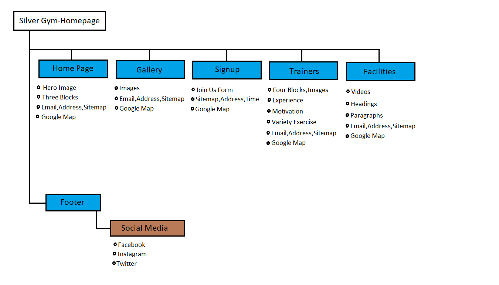

py# Silver Gym
## Contents
1. [Introduction](#Introduction)

2. [User Experience](#User-Experience) 
   
3. [Target](#Target)

4. [Structure](#Structure)
   
5. [Design](#Design)
  
6. [Features](#Features)

7. [Bugs](#Bugs) 

8. [Other Features](#Other-Features)

9. [Features Left to Implement](#Feature-Left-to-Implement)

10. [Technologies Used](#Technologies-Used)
  
11. [Frameworks Libraries and Programs Used](#Frameworks-Libraries-and-Programs-Used)   

12. [Testing](#Testing)

    - [Testing.md](assets/testing-file/testing.md)

13. [Deployment](#Deployment)

14. [Make a clone](#Make-a-clone)

15. [Credit](#Credit)

16. [Acknowledgements](#Acknowledgements)
***

## Introduction

The Silver Gym website is designed for individuals searching for a high quality gym. The purpose of this website is to showcase the facilities offered at this gym as well as the type of experience you can expect while using this gym.  The features of this website such as the gallery are aimed at motivating the customer to use silver gym for their fitness goals.
This website mainly focuses on informing potential customers about the facilities offered at this gym and what they can expect by joining. The page about trainers informs and motivates potential customers about the benefits they can get by joining and having access to highly qualified personal trainers. The Silver Gym website encourages people to join the gym to help keep their body healthy and strong.
Silver Gym website is my first Milestone Project out of five and its part of Full Stack Web development course at the Code Institute.
I mainly used HTML5 and CSS3 to make this website.

 [Go Top](#Silver-Gym)

## User Experience

### User Demographic
* New members.
* Current gym members.

### User Stories

#### New members :
- For new/potential members, I have included information about a free 24 hour car park for gym members.
- For new/potential members I have linked a Navbar and some blocks with a link to another page with information about the gym and the equipment available.
- For new/potential members, I have linked one block  called ”facilities” to the equipment video page where new members can see demonstrations of the various machines we have to offer. They can use the information on this page to plan their workouts.
- For new/potential members, I have made a block on the home page which has information that can help new members understand how our personal trainers can help them achieve their fitness goal.
- For new/potential members, they can easily link to any of the gyms social media pages by clicking the social media icons such as Facebook, YouTube and twitter.

#### Current gym members :
- For current gym members, they can login to the website with their current Email and Password to see anything in their account.
- For current gym members, they can easily link to any of the gyms social media pages by clicking the social media icons such as Facebook, YouTube and twitter.
- For current gym members, they can learn how to use the equipment correctly by watching the videos available on the facilities video link.

[Go Top](#Silver-Gym)

## Target
- On the website home page I  have added a big background image to try and motivate people to push towards their goals and look after their health.
- On the Home Page Everyone can see it's 20% off  for all  new members. I think this is a good way to support and encourage people to come and join silver gym.

#### Structure

* The type of site structure I have chosen for my website is a hierarchical structure which is demonstrated in the image below. The information architecture was arranged like this to ensure a user friendly experience as well as smooth navigation between the pages.

 #### Skeleton
 - I used [Figma](https://www.figma.com/file/CHXc92m6fwvkLuXmaUi6vf/Untitled?node-id=0%3A1) Wireframe to Attach the following pages. To convience user to use this website:
 

 #### Home-Page
 

  #### Gallery-Page
 

  #### signup-Page
 

  #### Trainers-Page
 

  #### Facilities-Page
 

 [Go Top](#Silver-Gym)
 ## Design

 ### Colour Schema
 * I used two colours for the background and content, which are white and dark grey. I have also used a small amount of green for hover and black for paragraph.
* I chose all the colours I used from [W3school](https://www.w3schools.com/colors/colors_picker.asp) website.

#### Typography
* I selected the font I used  from the [Google font](https://fonts.google.com/) website and linked it with my Css file.
* I used three font style Lato,Oswald and sans-serif.
* I have used Lato only for the paragraphs.
* I have used Oswald for the headings.
* I have used the font Sans-serif for backup in instances where if the correct link isn’t provided to the css3 file, a font type is still available. If this occurs and the Google font does not work the backup font sans-serif will always work.

#### Imagery
* The images used in this website play a very important role in the user experience of the website.
* The images shown on the website have been selected to motivate the potential customer and encourage them to join the gym. They have also been included to educate new gym users on basic excersie tecniques.
* All the images are downloaded free from the [pexels](https://www.pexels.com/search/gym%20and%20fitness/) website.

 [Go Top](#Silver-Gym)

## Features

* ## Header
* ## Home Page
* ## Gallery Page
* ## Signup Page
* ## Trainers Page
* ## Facilities Page
* ## Footer

### Header

In the header the main logo of the website is on the left hand side, and the navigation links are on the right hand side on all the pages.  On medium sized devices such as tablets the logo stays on the left hand side but the navigation links come under the logo in the middle. On small devices such as iPhones and Android phones both the logo and navigation bar move to the left hand side with the text in a small font size.

<a href="https://github.com/preetbhullar90/html-css-repository/blob/main/index.html" target="_blank" alt="SilverGym Home Page">Home Page</a>

The home page has a big hero image in the back. Under the hero image there are three blocks, one block is about facilities, and the other one is about Equipment and the last one is for trainers. Each block is linked to another page. Under the blocks there is a form section for Email, Phone number, Address , business Email and a link bar where the user can navigate to all the pages, a  google map of the business location is also featured.

<a href="https://github.com/preetbhullar90/html-css-repository/blob/main/gallery.html" target="_blank" alt="SilverGym Home Page">Gallery Page</a>

The gallery page features a lot of images about the gyms equipment and facilities. The gallery photos are divided in to columns, if the user is viewing the website on a big screen then the gallery will be displayed in four columns. On a medium sized screen the gallery will be seen in three columns. On small sized screens the user will see just two columns. If the user will hover the mouse over the images then images will zoom out slightly.

<a href="https://github.com/preetbhullar90/html-css-repository/blob/main/signup.html" target="_blank" alt="SilverGym Home Page">Signup Page</a>

On the signup page, the user will see a big signup form with space to enter your name, last Name, email, and password followed by a submit button . This submit form button is linked to the home page.  This form is the “join us” form, this is why when user will fill this form it will redirect them to the home page. The signup page has huge hero image with the following information underneath; Address, Email and linkbar.

<a href="https://github.com/preetbhullar90/html-css-repository/blob/main/trainners.html" target="_blank" alt="SilverGym Home Page">Trainers Page</a>

The trainer’s page has one big block which has four smaller blocks. Each block has a heading, image and paragraph. The blocks have a white background and each block shows different skills such as “what is a trainer’s role in your daily routine.”

<a href="https://github.com/preetbhullar90/html-css-repository/blob/main/facilities.html" target="_blank" alt="SilverGym Home Page">Faility Page</a>

The facilities page has a large variety of videos. Each video has a heading and paragraph.  The heading shows the name of the video and paragraphs explains how to exercise with each gym set. The videos are divided in to columns. On big screens the videos display horizontally in one line. On smaller screens they are displayed vertically in one column.

* ### Footer
 A footer is featured on the bottom of every page on the website. The footer has a social media heading and the following three social media icons; Facebook, YouTube, and twitter. Each Icon is linked directly with the corresponding website. Underneath each icons there is a p tag the p tag has year that the website was published and that all their rights are reserved.

 [Go Top](#Silver-Gym)

## Bugs
* I had problem with make a blog in the home page. So i got help from [stackflow](https://stackoverflow.com/) and [W3school](https://www.w3schools.com/) to fix it.

## Issue Left
* No any issue left.

## Other Features
* The logo is linked to the home page when the user will click on the logo it will take them to the home page.
* On the form page, navigation bar and email have a hover option. When the user will hover their mouse over it, it will show a different colour. This makes it easier to understand for the user that this is clickable link.
* The home page block also has a hover option when the visitor will hover on it then the images will zoom out.

### Feature Left to Implement

* Navigation bar with a hamburger logo on a small screen. The reason why didn't implement this is because I need to use JavaScript to do this but this project only uses HTML5 and CSS3.
* The Signup form and email should give a response to the user on the users email. This could not be implemented because JavaScript and a data storage option like mongodb is need for this feature.

## Technologies Used

### Languages Used

* [HTML5](https://en.wikipedia.org/wiki/HTML5)
* [CSS3](https://en.wikipedia.org/wiki/CSS)

### Frameworks Libraries and Programs Used

* [Font Awesome](https://fontawesome.com/ "Link to FontAwesome")
* Fonts awesome just used to import all the icons in the website.

* [Google Fonts](https://fonts.google.com/ "Link to Google Fonts")
* Google fonts was used to import the google style fonts in css like Lato, Oswald and sans-serif.

* [Git](https://git-scm.com/ "Link to Git homepage")
* Gitpod was used for writing the code in the terminal it was also used to commit and push the code in GitHub.

* [GitHub](https://github.com/ "Link to GitHub")
* GitHub was used to store the data which was pushed by Gitpod.

* [Figma](https://www.figma.com/ "Link to Figma homepage")
* Figma was used to create the wireframe of the project before starting code on the terminal.

* [Am I Responsive?](http://ami.responsivedesign.is/# "Link to Am I Responsive Homepage")
* Am I Responsive was used to see if project is responsive on different types of devices.

 [Go Top](#Silver-Gym)

## Testing
The testing process can be found [here](assets/testing-file/testing.md) 

## Deployment

### Github Pages
To deploy a GitHub Page from the GitHub Repository, The following options were used:

1. [Login](https://github.com/) into Github or [Signup](https://github.com/) for new.

2. Click on your Repository, you can click on the left side on the side bar or go to the right side  to click on your profile and select your Repository option.

3. Click on the Setting option which is located on the top of your Project.

4. Scroll down and in the **GitHub Pages** option and click on  the Check it out here! Link.

5. Under "Source", click the dropdown option called "None" and select "Master Branch". 

6. 6. Refresh your page on the top left corner with the circle button.

7. Scroll back down in  **GitHub Pages** and again click on the  Check it out here! Link now published site link in the "GitHub Pages" section. 

### Make a Clone

1. [Login](https://github.com/) into Github or [Signup](https://github.com/) for new.

2. Click on **Your Repository** option select your project then click on the **code** dropdown menu.

3. To clone the repository using HTTPS, under "Clone with HTTPS", copy the link. 

4. In your local IDE open the Git Bash terminal.

5. Change the current working directory to the location where you want the cloned directory to be made. 

6. Type git clone, and then paste the URL you copied in Step 3. 

       git clone  https://github.com/USERNAME/REPOSITORY

7. Press Enter. Your local clone will be created. 

## Credit

### Content
* All content Ideas were taken from researching gyms using Wikipedia.

### Code
* All the code was written by myself, but I took some help from stackoverflow, W3School and Google. I did this to research things like “Like how to make website responsive”.

### Media
* All the videos and images download free from [pexels](https://www.pexels.com/search/gym%20and%20fitness/).
________________________________________________________________________________________________________________

## Acknowledgements
* I would especially like to thank my wife, who helped me by giving me some ideas regarding my website. She motivated me to finish this project to the best of my ability.
* Secondly I would like to thank my mentor Seun, she helped during the whole process of the project.
* Lastly I would like to acknowledge the W3School website as I gained many ideas from there. 

 [Go Top](#Silver-Gym)